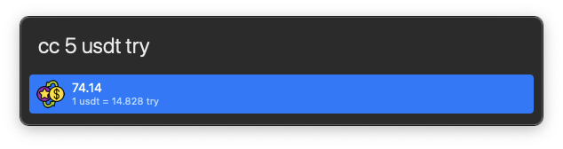
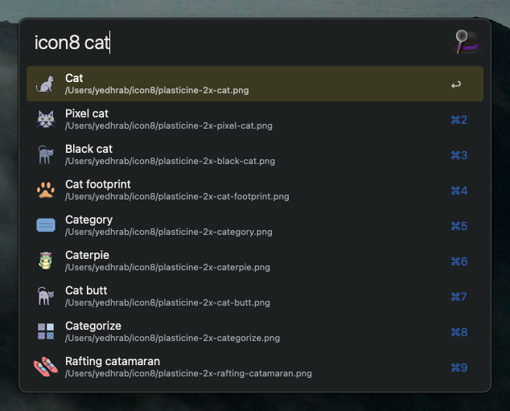
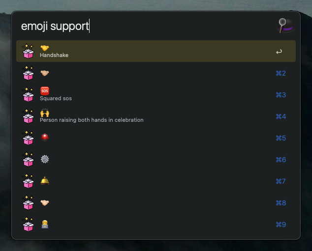

# 🎓 My Alfred Workflows 

- All workflows can be installed from release page
- Open toggle menus for see details

---

<details>
<summary><b>Converter Alfred</b> Convert FIAT and Crypto</summary>

- 💚 `cc 2 usdt try` to convert `2 USDT` to `TRY` value
- 🎉 Complex queries like `2 TRY PHP` is working now!
- 🔐 To use this workflow you need to check out "Get Your Free Api Key for FIAT" section
- ↩️ Press enter (⌅) to paste result



> For more detail check out: https://github.com/yedhrab/YConverter

## 🔑 Get Your Free Api Key for FIAT

- Click the link: https://openexchangerates.org/signup/free
- Sign up
- Verify your email and use the key that send to your e-mail

## 👮‍♂️ Free Forex API Rate Limits

- Currency Pairs per Request: 2
- Number of Requests per Hour: 100
- Date Range in History: 8 Days
- Allowed Back in History: 1 Year(s)

## Crypto Convertion

- Crypto convertion uses **Binance** tickers
- There is no limit

## 🗄 Cache System

- All data is stored in `$HOME/yconverter.yml`
- All cached pair value are refreshed every **10 mins** for fiat, **1 min** for crypto

</details>


<details>
<summary><b>Icon8 Alfred</b> Download image with Pack and Downloads count and copy path of it from icon8 to clipboard</summary>

- Type `+` to end of the query to see more results.
- Search `query` on flaticon (for more specific settings, change shape or order_by in `main.py`)
- Creates `icon8` folder to `HOME` directory and store every query it's own folder
- Download all image results if it's not exists
- When result selected, copy image path to clipboard



</details>

<details>
<summary><b>Flaticon Alfred</b> Download image with Pack and Downloads count and copy path of it from flat icon to clipboard</summary>

- Type `+` to end of the query to see more results.
- Search `query` on flaticon (for more specific settings, change shape or order_by in `main.py`)
- Creates `flaticon` folder to `HOME` directory and store every query it's own folder
- Download all image results if it's not exists
- When result selected, copy image path to clipboard


</details>

<details>
<summary><b>EmojiDB Alfred</b> Search emojidb to find all relative emojis for {query}</summary>

- Search [emojidb](https://emojidb.org) to find all relative emojis for {query}
- Enter to copy clipboard, ⌘ enter to open in emojipedia



</details>

## The ones that I have created but not using

<details>
<summary><b>Strings Alfred</b> Manipulate any string or url</summary>

- Manipulate any string or url
- `str` for string operations
- `str_url` for url operations
- Auto update via `github` once for every week


</details>

<details>
<summary><b>Imgur alfred</b> Post to imgur and capture image link to clipboard</summary>

- Post to imgur and capture image link to clipboard
- Type `imgur` and paste path of file
- Alfred workflow version of [images-upload-cli](https://github.com/DeadNews/images-upload-cli)


</details>

<details>
<summary><b>PyPIAlfred</b> Search pypi for package, enter to open in pypi</summary>

- Search pypi for package, enter to open in pypi
- Hold ⌘ and enter to copy `pip install -U package` command to clipboard
- Hold ⇧ and enter to download new release if update item appear
- Automatically checks update via `github` every 1 week
- Limitation `only shows first page`


    
</details>

<details>
<summary><b>Github Alfred</b> Search github for query</summary>

- Search github for query
- `GITHUB_TOKEN` environmental variables needed for personal repo search
- If not set, search globally (max 20 result)
- Auto update via github (checks once a week)

> Via caches, don't make more requests...


</details>

---

## 🪪  License

```
Copyright 2022 Yunus Emre Ak ~ YEmreAk.com

Licensed under the Apache License, Version 2.0 (the "License");
you may not use this file except in compliance with the License.
You may obtain a copy of the License at

    http://www.apache.org/licenses/LICENSE-2.0

Unless required by applicable law or agreed to in writing, software
distributed under the License is distributed on an "AS IS" BASIS,
WITHOUT WARRANTIES OR CONDITIONS OF ANY KIND, either express or implied.
See the License for the specific language governing permissions and
limitations under the License.
```
